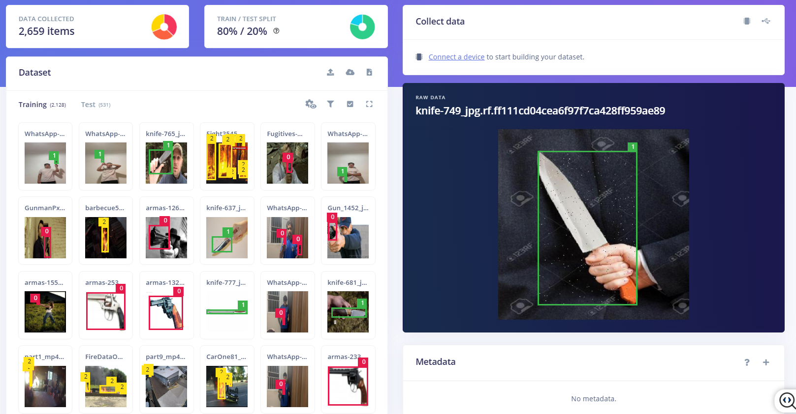
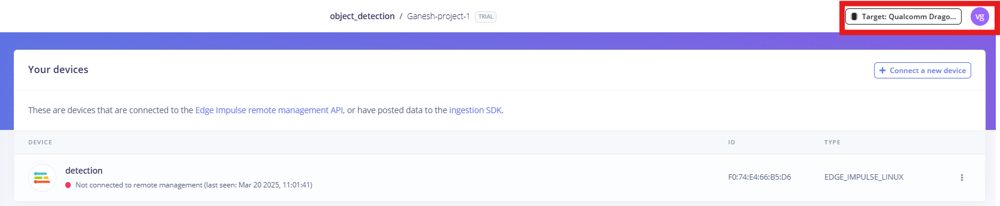
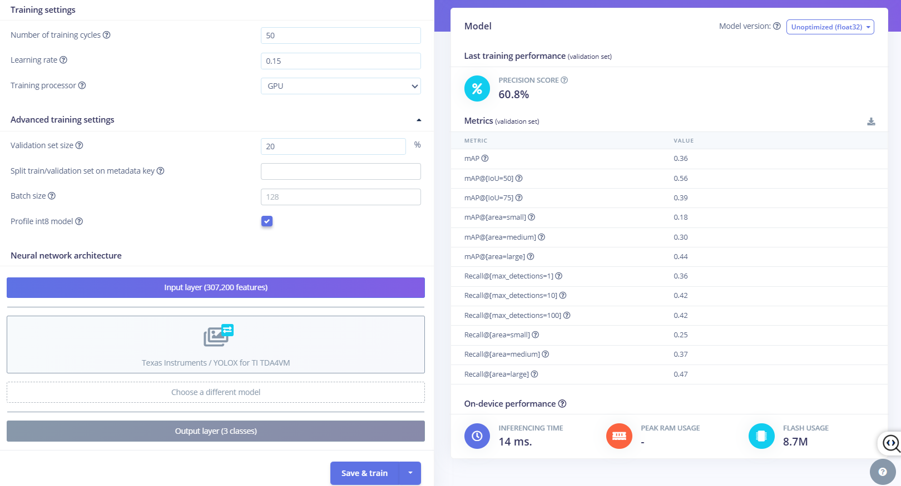
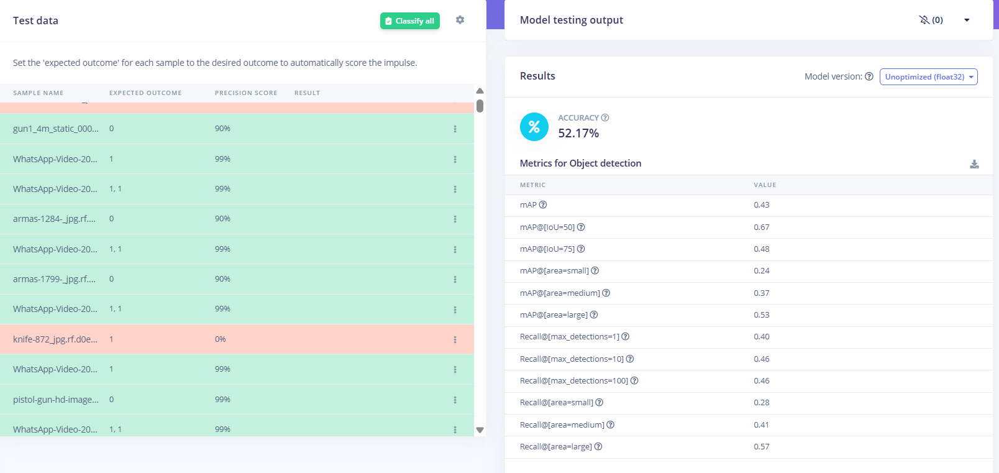
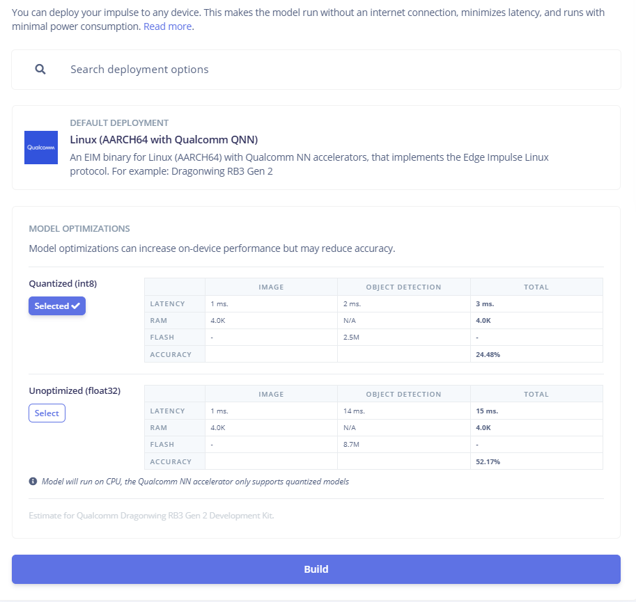
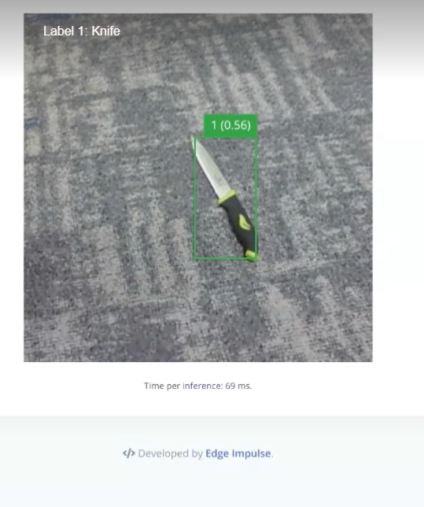

# Training and Deploying Object Detection Models with Edge Impulse on Qualcomm RB3 Gen2

## Overview
This guide provides a complete workflow for building and deploying object detection models on the Qualcomm RB3 Gen2 board using Edge Impulse's machine learning platform. We cover the entire process from collecting and labeling images to selecting the right model architecture, optimizing performance, and deploying your solution—enabling real-time object detection for applications in industrial automation, security, autonomous systems, and retail.

The RB3 Gen2's powerful computing architecture (with Kryo CPU, Adreno GPU, and Hexagon DSP) combined with Edge Impulse's streamlined development tools creates an ideal environment for edge AI deployment. Following our recommended best practices for model optimization and hardware acceleration, you'll achieve fast inference times under 50ms while maintaining high accuracy, all within the power constraints of edge devices and with straightforward integration into existing systems.

## What You'll Achieve
- Deploy real-time object detection at the edge with minimal latency
- Develop production-ready computer vision applications for real-world use cases.
- Execute a complete machine learning workflow from data collection to deployment.

## Technical Requirements
- Edge Impulse account (free tier available)
- Qualcomm Robotics RB3 Gen2 development board
- Host computer for development
- Internet connection for initial setup and training

## Implementation Roadmap
### 1. Data Collection
A well-curated dataset is critical for model performance. Follow these best practices:
-   Capture diverse, high-quality images representing real-world scenarios
-   Implement data augmentation to enhance model robustness
-   Create a balanced dataset across all target classes
-   Leverage Edge Impulse's data ingestion API for automated collection

#### Dataset Configuration
- **Dataset**: [Name of dataset, e.g., COCO, Pascal VOC, custom dataset]
- **Train/Val/Test Split**: 70%/15%/15%
- **Annotations Format**: [COCO JSON, Pascal VOC XML, YOLO txt]

**Edge Impulse Exporter format (info.labels files)**
The Edge Impulse Exporter acquisition format offers a straightforward and user-friendly method for organizing files and their corresponding labels. Data stored in this format follows the directory structure outlined below:

```bash
.
├── info.labels
└── training
│   ├── info.labels
│   ├── image1.jpg
│   ├── image2.jpg
│   ├── image3.jpg
│   ...
│   └── file100.jpg
└── testing
    ├── info.labels
    ├── image1.jpg
    ├── image2.jpg
    ...
    └── image.jpg

2 directories
```
For more details, please refer to this [Link](https://docs.edgeimpulse.com/docs/edge-impulse-studio/data-acquisition)

### 2. Precision Data Annotation
Accurate labeling is key to achieving high model accuracy. Ensure the following:
-   Create accurate bounding boxes using Edge Impulse's annotation tools
-   Implement consistent labeling conventions
-   Validate annotations through peer review
-   Export annotations in standard formats (COCO, Pascal VOC)

***Label Mapping:***
-   **0** --> Gun
-   **1** --> Knife
-   **2** --> Fire



### 3. Advanced Model Architecture Selection
Selecting the appropriate model is crucial for balancing accuracy and performance:
-   Compare performance across model architectures:
    -   FOMO (Faster Objects, More Objects): Ideal for ultra-low latency applications with high-speed object detection.
    -   YOLOX for TI TDA4VM: Preferred for high-accuracy requirements and real-time object tracking.
    -   MobileNetSSD: Offers a balance between speed and precision, making it suitable for most edge applications.
-   Customize hyperparameters (e.g., batch size, learning rate, anchor box settings) based on your specific use case.

***Model Architecture***
- **Base Model**: [e.g., Faster R-CNN, YOLO, SSD, EfficientDet]
- **Backbone**: [e.g., ResNet50, MobileNetV2, EfficientNet-B0]
- **Input Resolution**: 640×640 pixels

**Target Device**
Ensure that you select the Qualcomm Dragonwing RB3 Gen 2 Development Kit as your target device. You can update the target selection at the top of the page, near your user profile icon.



**Object Detection Training settings**

***Training Hyperparameters***
- **Batch Size**: 128
- **Learning Rate**: 0.01
- **Optimizer**: Adam (β1=0.9, β2=0.999)
- **Epochs/Iterations**: 50 epochs
- **Data Augmentation**: Random flip, rotation, scale, color jitter
- **Loss Functions**: Classification loss (CE), Regression loss (Smooth L1)

***Hardware Configuration***
- **GPU**: [e.g., NVIDIA RTX 3090, Tesla V100]
- **Training Time**: Approximately 1 hour for 50 epochs(2.5k training data)



**Model Testing**

⚠️ The parameters and base model for transfer learning may vary depending on the specific use case.

📈 To improve accuracy, consider increasing the number of epochs and expanding the training dataset.




### 4. Performance Optimization
Maximizing efficiency on the RB3 Gen2 requires careful model tuning:

-   Implement quantization-aware training to reduce model size without significant accuracy loss.
-   Leverage the Qualcomm Neural Processing SDK to optimize performance on specialized hardware.
-   Deploy inference workloads on the DSP/GPU for accelerated processing.
-   Balance model complexity with power consumption for optimal edge deployment.

Select Linux AARCH64 with Qualcomm QNN 

**Configure your deployment**

This will download an .eim model



### 5.Deployment Pipeline

-   Installing the Edge Impulse Linux CLI

    On the RB3 install the Edge Impulse CLI and other dependencies via:
    ```bash
    $ wget https://cdn.edgeimpulse.com/firmware/linux/setup-edge-impulse-qc-linux.sh
    $ sh setup-edge-impulse-qc-linux.sh
    ```
-   Connecting to Edge Impulse
    Once all dependencies are installed, run the following command:
    ```bash
    $ edge-impulse-linux
    ```
    This will launch a setup wizard that prompts you to log in and select an Edge Impulse project. To switch projects or use a different camera (such as a USB camera), run the command with the --clean option:
    
-   Using the Edge Impulse Linux CLI
    To run your impulse locally on the RB3, open a terminal and execute:
    ```bash
    $ edge-impulse-linux-runner
    ```
    This command will automatically compile your model with full hardware acceleration, download it to your RB3 Gen 2, and begin classification. To switch projects, use the --clean option

    Run .eim model on RB3 Gen2
    ```bash
    $ edge-impulse-linux-runner --model-file downloaded-model.eim
    ```
    **Inference Result**

    
    

    Alternatively, you can select (Qualcomm IM SDK GStreamer Pipeline) from the Deployment page and check this  [Link](https://docs.edgeimpulse.com/docs/run-inference/qualcomm-im-sdk-gstreamer-pipeline)

## Troubleshooting
-   Check camera connections and permissions
-   Ensure that your model is compatible with the RB3 Gen 
-   Monitor system resources during inference

## Open Issues
**Unsupported Inference Engine for Quantized INT8 Model on DSP**
While running a quantized INT8 YOLOX model on the TI TDA4VM DSP, facing following error:

***EI_IMPULSE_UNSUPPORTED_INFERENCING_ENGINE = -10;***
// The selected inference engine cannot run this impulse.

This issue prevents the model from executing on the DSP. To resolve this, ensure that the selected inference engine in Edge Impulse Studio supports quantized INT8 models for optimal DSP performance.